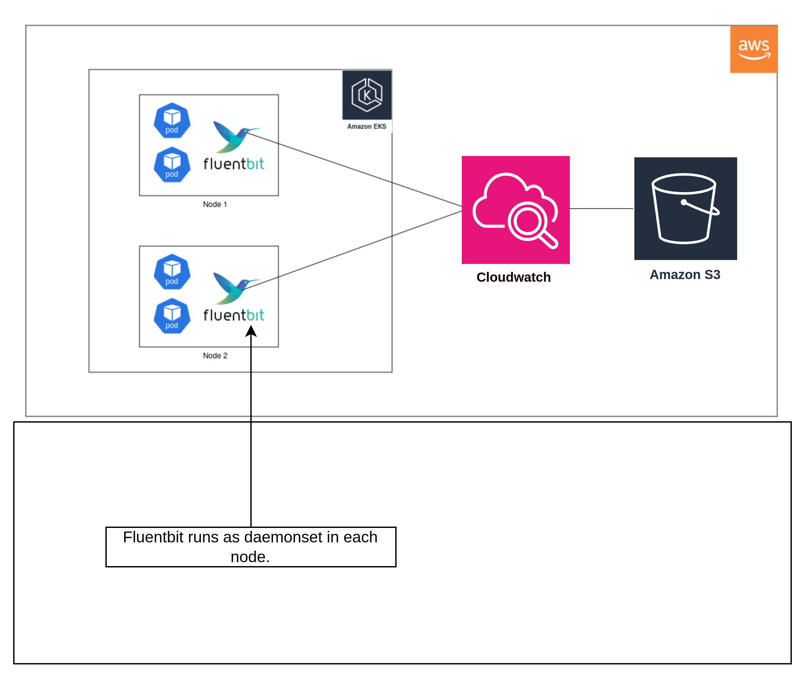

## Kubernetes fluent-bit & Cloudwatch Integration

### Usecase:

- Storing kubernetes logs is a challenge for many projects. This project demonstrates the streaming of logs to Cloudwatch using fluent-bit as a collector.

### Architecture diagram:



### Project description:

Repo has two manifests.

- `fluent-bit.yaml`
  - creates service-account, cluster-role, cluster-role-binding, fluent-bit-configmap objects
  - fluentbit requires permission to different namespaces, pods and kubelet api
- `counter.yaml`
  - creates a dummy pod that continuously emits logs

### Get started

- Clone the repo and run following commands

```
kubectl apply -f amazon-cloudwatch-namespace.yaml
kubectl apply -f fluent-bit.yaml
kubectl apply -f counter.yaml
```

- go to your cloudwatch page, and check for log groups and streams
- log collection can also be verified by`kubectl logs -f <fluent-bit-pod>  -n amazon-cloudwatch`
